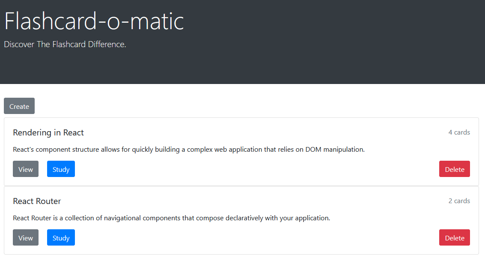
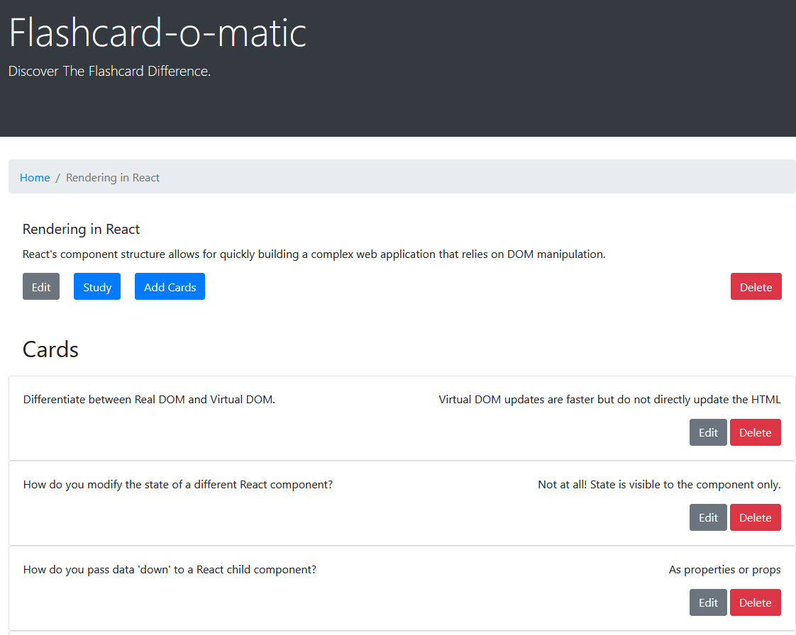
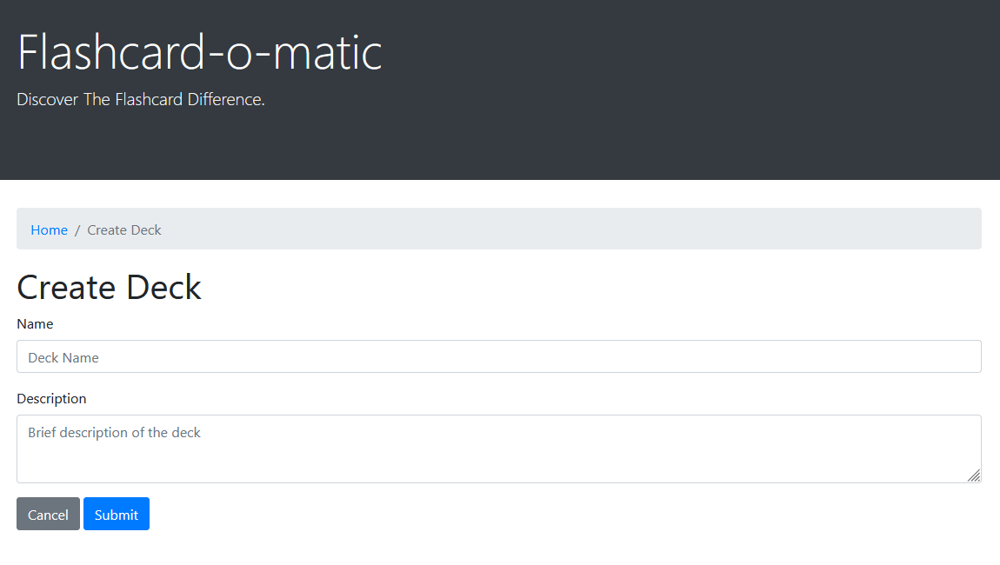
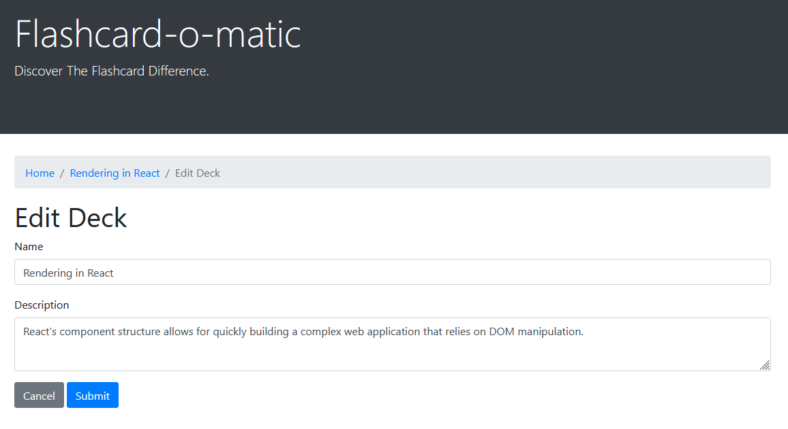
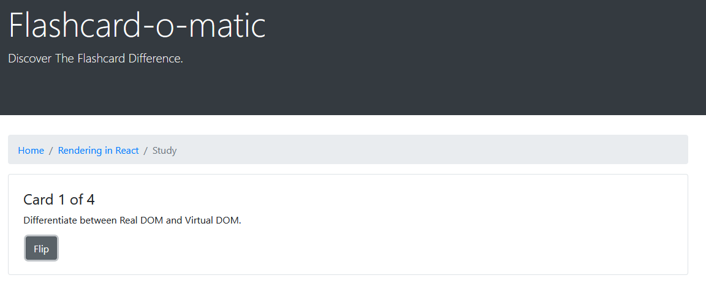
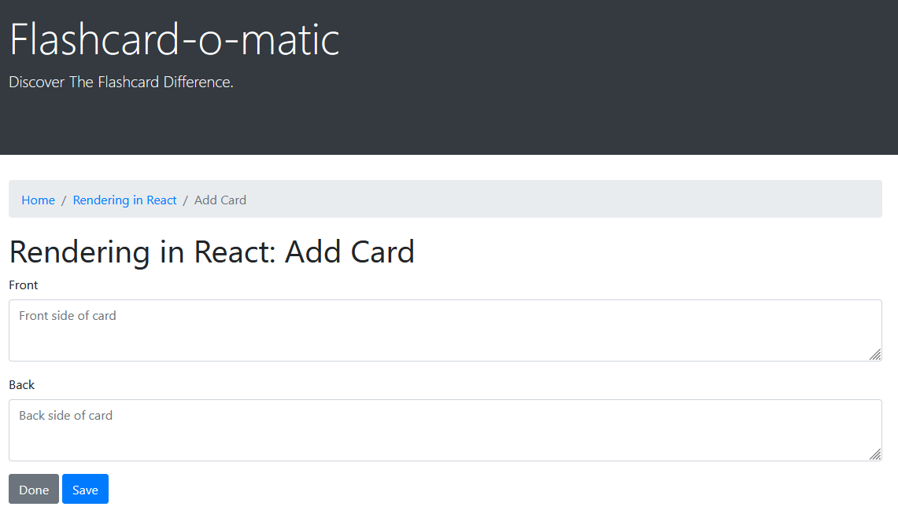
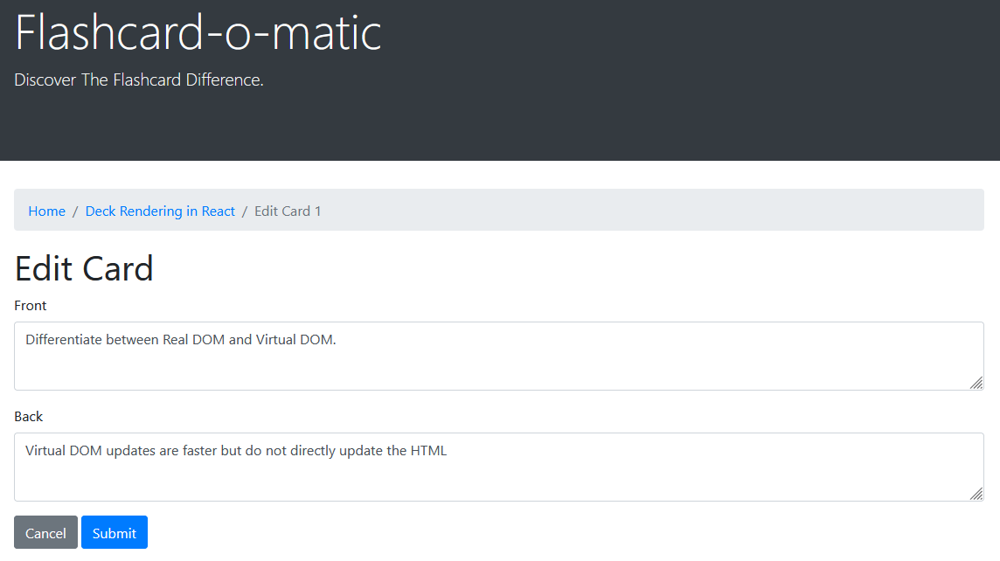

# Flashcard-O-Matic App

Flashcard-O-Matic is an app created with ReactJS, that enables users to create, edit, and delete decks of two-sided flashcards. Within decks, individual flashcards can be added, removed, and edited. Finally, users may study the flashcards by using the "study" screen.

## Screenshots

### Homepage

The Homepage lists all existing decks.

Homepage buttons:

- Create: Takes you to the Create Deck screen
- View: Takes you to the Deck screen
- Study: Takes you to the Study screen
- Delete: Deletes specific deck. (A modal confirmation message will pop-up)



### Deck Screen

The Deck Screen shows the name and description of the deck, along with all of the cards contained in the deck. You may click the "Add Cards" button to create cards for the deck.



### Create Deck

Enter a deck name and description to create a new deck.



### Edit Deck

Alter deck name and/or description to edit an existing deck.



### Study Deck

The Study Deck screen displays one flashcard at a time, starting with the front-side of the card. Clicking the flip button will desplay the back-side of the card, and a "Next" button will appear. Click "Next" to move to the next card in the deck.



### Add Card

Add the card's "question" to the front-side, and add the "answer" to the back-side.



### Edit Card

alter front and/or back to edit an existing card.



### Install

```sh
npm install
```

### Usage

```sh
npm start
```

### Run tests

```sh
npm test
```
